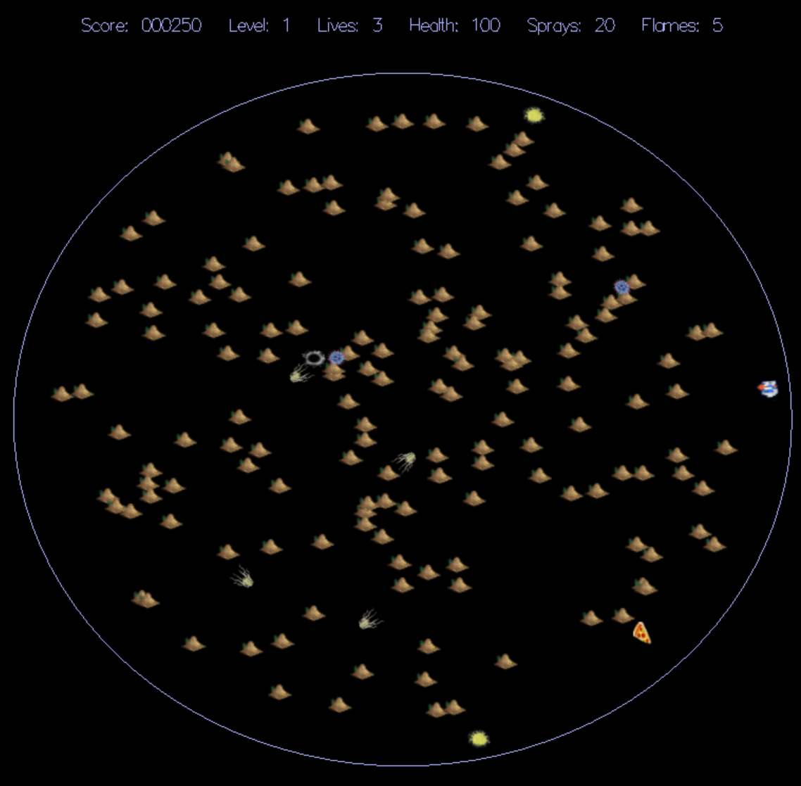

# Kontagion
Arcade 2D shooter Game. Project developed in CS32 Winter 2020 with Professor Nachenberg at UCLA.

Included Files:
-   Actor.h: Declaration of actor classes and constants.
-   Actor.cpp: implementation of the actor classes.
-   StudentWorld.h
-   StudentWorld.cpp: StudentWorld class is responsible for keeping track of the gameplay and the game world.
-   Kontagion.exe + all other .dll files: the executable files of the game.

### Screenshot:

